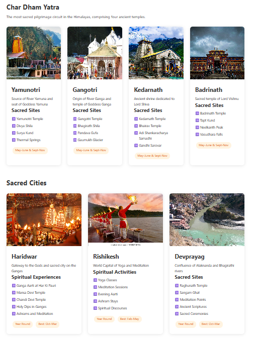

# Uttarakhand-Tourism
A responsive and interactive tourism website showcasing the natural beauty, culture, and travel destinations of **Uttarakhand, India**, built with HTML, CSS, and JavaScript. It highlights the state’s natural beauty, popular destinations, culture, and adventure activities with an interactive and user-friendly design. 
## 🔹 Features
- Built using **HTML, CSS, and JavaScript**
- Responsive design for mobile and desktop
- Sections highlighting popular destinations, culture, food, and adventure activities
- Smooth navigation and interactive UI
- Simple, lightweight, and beginner-friendly codebase

## 🔹 Tech Stack
- **Frontend:** HTML, CSS, JavaScript  
- **Design:** Custom CSS styling  

## 🔹 Purpose
This project was created to promote the tourism potential of Uttarakhand and provide travelers with a user-friendly platform to explore its attractions.

## 🔹Snapshots

### 🏠 Landing Page
<p align="center">
  
  
</p>

### ℹ️ About Page
<p align="center">
  
  
</p>

### 🗺️ Destinations Page
<p align="center">
  
  
</p>

### 🏔️ Adventure Page
<p align="center">
  
  
</p>

### 🕉️ Spiritual Page
<p align="center">
  
  
</p>

### 🌿 Wildlife Page
<p align="center">
  
  
</p>

### 💡 Travel Tips Page
<p align="center">
  
  
</p>

### 📩 Contact Page
<p align="center">
  
  
</p>

## 🚀 How to Run
1. Clone this repository  
   ```bash
   git clone https://github.com/your-username/Uttarakhand-Tourism.git
